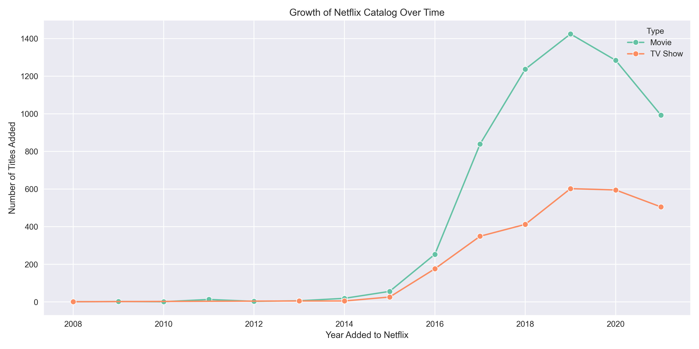
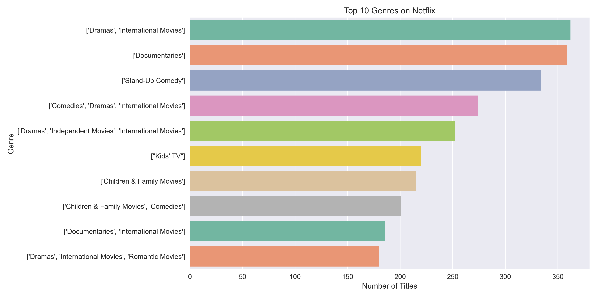
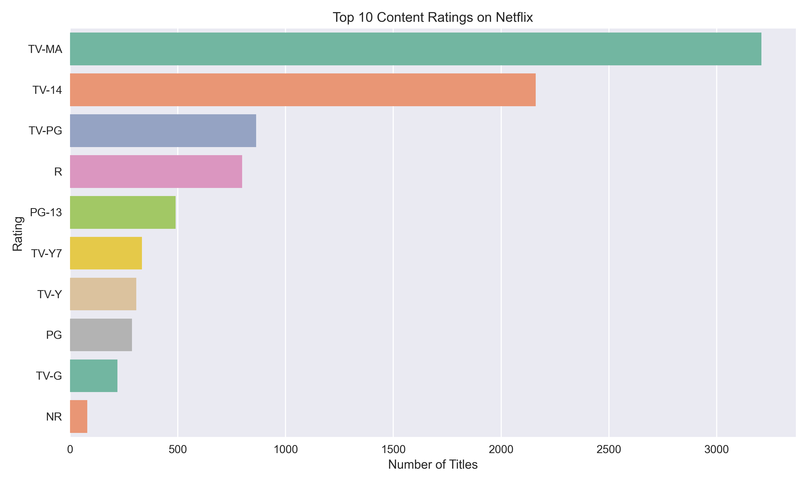

# 📺 Netflix Movies & TV Shows – Exploratory Data Analysis

This project explores the **Netflix Movies and TV Shows dataset** to understand how Netflix’s catalog has evolved over time.  
The analysis uncovers insights on growth, genres, and audience targeting using **Python, Pandas, Matplotlib, and Seaborn**.

---

## 🎯 Goals

- Clean and standardize raw dataset
- Explore patterns by year, rating, country, and genre
- Visualize trends using Python libraries

---

## 📑 Dataset

[Netflix Movies and TV Shows (Kaggle)](https://www.kaggle.com/shivamb/netflix-shows)  
Contains ~8,800 titles with metadata such as type, release year, director, cast, country, rating, and description.

---

## ❓ Guiding Question

**How has Netflix’s catalog evolved over time in terms of Movies vs. TV Shows, genres, and audience ratings?**

### 🔍 Sub-questions

1. **Growth Over Time**

   - How many titles were added each year?
   - Has there been a shift toward TV Shows compared to Movies?

2. **Genre Analysis**

   - What are the most common genres overall?
   - Do certain genres dominate in Movies vs. TV Shows?

3. **Audience Ratings**
   - Which ratings (TV-MA, PG, etc.) are most common?
   - Is Netflix skewed toward mature audiences?

---

## ⚡ Tools & Libraries

- Python 3.12
- Pandas, NumPy
- Matplotlib, Seaborn
- Jupyter Lab

---

## 📂 Project Structure

    ├── data
    │ ├── netflix_clean.csv
    │ ├── netflix_clean.parquet
    │ └── netflix_titles.csv
    ├── notebooks
    │ ├── 01_load_and_scan.ipynb
    │ ├── 02_cleaning_standardization.ipynb
    │ └── 03_exploratory_data_analysis.ipynb
    ├── README.md
    ├── reports
    │ ├── netflix_growth_over_time.png
    │ ├── netflix_top_genres.png
    │ ├── netflix_top_ratings_by_type.png
    │ └── netflix_top_ratings.png
    └── requirements.txt

---

## 📈 Expected Insights

- Netflix’s catalog has grown significantly since 2010, with a shift toward **more TV Shows**.
- **Dramas, Comedies, and Documentaries** dominate the catalog.
- A majority of content is rated **TV-MA**, indicating a focus on mature audiences.

---

## 📊 Key Insights

### 1. Growth Over Time

- Netflix’s catalog grew rapidly starting around **2015**.
- **TV Shows** have increased their share significantly, reducing Netflix’s dependence on movies.

---

### 2. Genre Analysis

- The most common genres are **Dramas, Documentaries, International Movies, and Stand-Up Comedy**.
- **TV Shows** are dominated by **International Dramas and Mysteries**.
- **Movies** are strong in **Documentaries, Comedies, and International titles**.

---

### 3. Audience Ratings

- Netflix skews heavily toward **mature audiences**, with **TV-MA** as the largest category.
- Secondary ratings include **TV-14, PG-13, and R**.
- **TV Shows** are more likely to be **TV-MA**, while Movies spread across PG/PG-13/R.

---

## ✍️ Author

**Jordan Purcell**  
📧 [jjordan.p98@gmail.com](mailto:jjordan.p98@gmail.com)  
🔗 [LinkedIn](https://www.linkedin.com/in/jordan-purcell-07352523a/) | [GitHub](https://github.com/JJJJordy)
